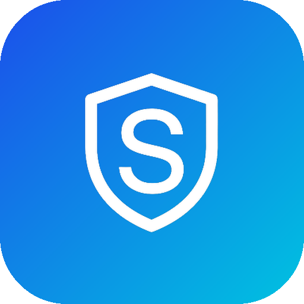
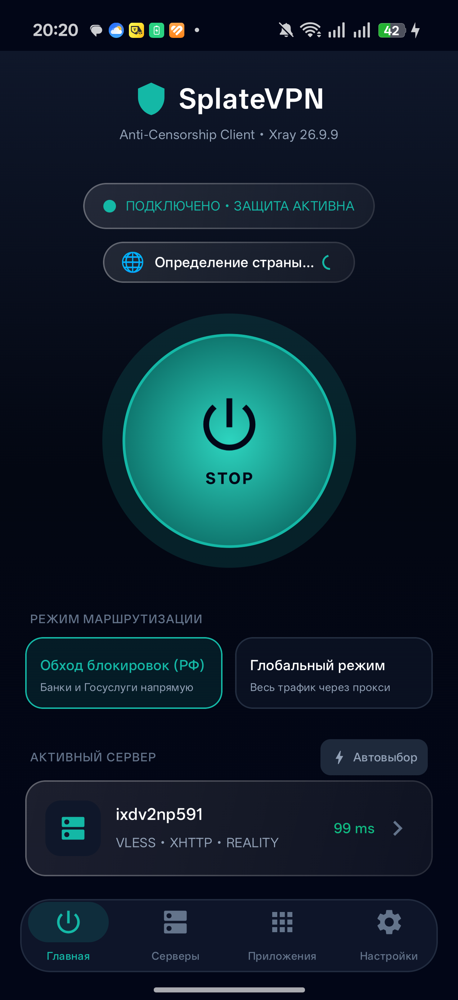
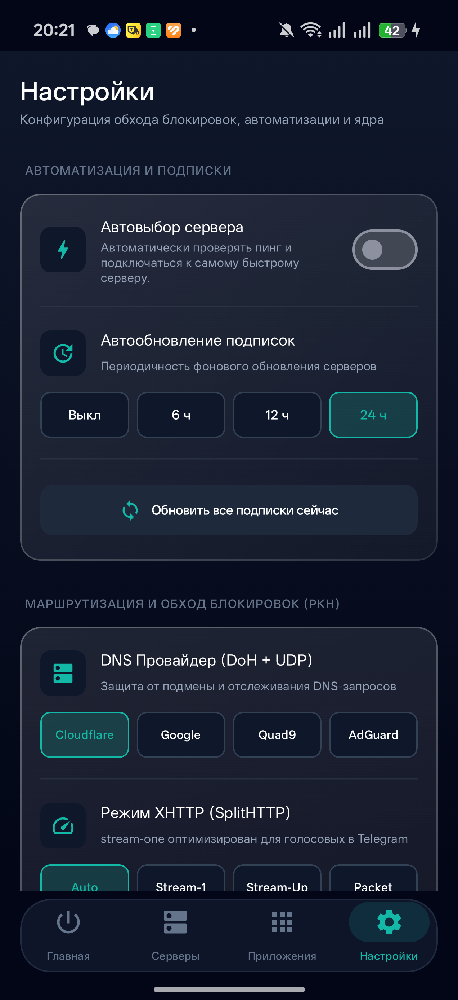
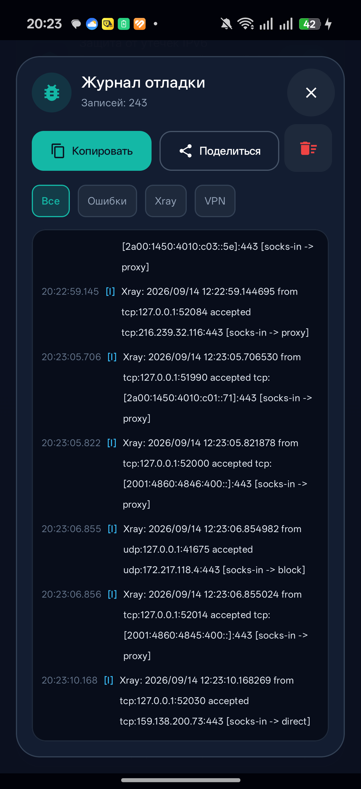

<p align="center">
  
</p>

<h1 align="center">🛡️ SplateVPN (Android)</h1>

<p align="center">
  <b>Современный высокопроизводительный VPN-клиент нового поколения для Android на базе ядра Xray-core 26.9.9 и hev-socks5-tunnel.</b><br>
</p>

<p align="center">
  
  
  
  
  
  
</p>

---

> [!IMPORTANT]
> ⚠️ **Проект находится в стадии активной разработки (Beta).**
> Приложение активно дорабатывается и полируется. **Обновления выходят каждую неделю!**  
> Если вы обнаружили баг или у вас есть предложение по улучшению, отправьте диагностический отчёт через встроенный журнал логов или создайте Issue.

---

## 📸 Скриншоты интерфейса

<p align="center">
  
  &nbsp;&nbsp;
  
  &nbsp;&nbsp;
  
</p>

---

## ⚡ Ключевые возможности

### 🚀 Передовые протоколы и транспорты
* **VLESS** с поддержкой **XTLS Reality** и **Vision flow** — трафик маскируется под легитимные TLS-соединения с популярными веб-сервисами, делая его неотличимым для DPI.
* **XHTTP (SplitHTTP)** — передовой протокол доставки пакетов с оптимизированными режимами:
  * `stream-one` — исключает задержки и обрывы голосовых сообщений/звонков в Telegram;
  * `stream-up`, `packet-up` и `auto` — интеллектуальная адаптация под состояние сети.
* **Trojan, VMess, Shadowsocks (AEAD)** — полная обратная совместимость с классическими протоколами.
* Транспорты: **gRPC, WebSocket, HTTP/2, TCP, mKCP**.

### 🇷🇺 Умная маршрутизация (Smart RU Routing)
* **Режим «Обход блокировок (РФ)»**:
  * Заблокированные сайты, зарубежные ресурсы и соцсети направляются через зашифрованный туннель.
  * **Банковские приложения** (Сбер, Т-Банк, ВТБ, Альфа-Банк, Райффайзен и др.), **Госуслуги, Налог.ру, Mos.ru, сервисы Яндекса, VK, Mail.ru** и любые сайты в зонах `.ru`, `.su`, `.рф` идут **напрямую**.
  * Вам **больше не нужно отключать VPN**, чтобы перевести деньги в банке или зайти на Госуслуги!
  * Базируется на встроенных офлайн-геобазах `geoip.dat` и `geosite.dat`.
* **Режим «Полный туннель»**: перенаправление 100% трафика устройства через прокси для полной изоляции.

### 🛡️ Глубокая защита от цензуры и утечек
* **Strict FakeDNS (198.18.0.0/15)** — внутренний пул Fake-IP для мгновенного резолвинга (<1 мс) без риска DNS-spoofing или отравления кэша операторами связи.
* **Split-DNS (DoH + UDP)**:
  * Внешние домены резолвятся через зашифрованные DNS-over-HTTPS (DoH) на выбор: **Cloudflare, Google, Quad9, AdGuard**.
  * Российские домены запрашиваются через прямой быстрый DoH Яндекса для получения корректных CDN-адресов.
* **Блокировка QUIC (UDP 443)** — браузеры и приложения мгновенно переключаются на надежный TCP/TLS fallback. Это решает зависания видео на YouTube, стримов Discord и загрузки сайтов при выборочной блокировке UDP провайдерами.
* **Сниффинг доменов (RouteOnly)** — корректно определяет целевой SNI для применения правил маршрутизации без искажения прямых MTProto-пакетов в Telegram.
* **Защита от утечек IPv6** — автоматическое пресечение нешифрованного IPv6-трафика.

### 📱 Раздельное туннелирование (Per-App Routing)
* Тонкая настройка: перенаправляйте через VPN только те приложения, которым это необходимо (например, Instagram, YouTube, Discord, браузеры), оставляя остальные приложения работать через стандартный мобильный/Wi-Fi интернет.

### 🔄 Автоматизация и управление серверами
* **Подписки**: добавление по URL и автообновление серверов в фоне (каждые 6, 12, 24 часа или вручную).
* **Мгновенный пинг**: проверка доступности и задержки серверов в один клик.
* **Автовыбор сервера**: автоматическое подключение к узлу с наименьшей задержкой.
* **Встроенный редактор нод**: тонкая ручная правка параметров сервера прямо в приложении (SNI, Fingerprint, Reality pbk / sid / spx, Path, Host, UUID и порт).

### 🐞 Интерактивный журнал отладки (Live Logs)
* Встроенный просмотрщик логов в реальном времени с выводом событий ядра Xray и статусов туннеля VPN.
* Фильтры по категориям: `Все`, `Ошибки`, `Xray`, `VPN`.
* Копирование и отправка диагностического отчёта в буфер или мессенджер в один тап.

### 🎨 Премиальный дизайн
* Современный стек **Jetpack Compose + Material 3**.
* Неоновый киберпанк/Glassmorphic стиль с плавной анимацией статуса подключения.
* Поддержка 4 тем: **Dark, AMOLED (настоящий черный), Light, Системная**.
* Полная локализация на **русский** и **английский** языки.

---

## 🏗️ Архитектура и стек технологий

```
┌─────────────────────────────────────────────────────────┐
│              UI Слой (Jetpack Compose)                  │
│   • HomeScreen (Статус, переключатель, шлюз, пинг)      │
│   • ServersScreen (Узлы, подписки, автовыбор)           │
│   • PerAppScreen (Раздельное туннелирование)            │
│   • SettingsScreen (Маршрутизация, DoH, FakeDNS, темы)   │
│   • LogsDialog (Live отладка и экспорт логов)           │
└────────────────────────────┬────────────────────────────┘
                             │ StateFlow / Coroutines
┌────────────────────────────▼────────────────────────────┐
│          Бизнес-логика (ViewModel & Hilt DI)            │
│   • MainViewModel, ServerRepository, SettingsManager    │
└────────────────────────────┬────────────────────────────┘
                             │
┌────────────────────────────▼────────────────────────────┐
│                 VPN Слой & Ядро                         │
│   • SplateVpnService (Android VpnService)               │
│   • XrayCoreManager (Управление процессом ядра Xray)    │
│   • XrayConfigGenerator (Генерация JSON-конфигурации)   │
│   • libhev-socks5-tunnel.so (Высокоскоростной TUN2SOCKS)│
│   • libxray.so (Xray-core v26.9.9 C-Shared/Go Binary)   │
└─────────────────────────────────────────────────────────┘
```

* **Язык**: Kotlin 2.0+
* **Архитектура**: MVVM + Clean Architecture
* **Инъекция зависимостей**: Dagger Hilt 2.51.1
* **Локальное хранилище**: Room DB 2.6.1 + SharedPreferences
* **Сетевое ядро**:
  * [Xray-core](https://github.com/XTLS/Xray-core) `v26.9.9` (arm64-v8a)
  * [hev-socks5-tunnel](https://github.com/heiher/hev-socks5-tunnel)

---

## 📥 Установка и запуск

### Готовый APK
1. Перейдите в раздел **Releases** репозитория (или возьмите актуальный файл `SplateVPN.apk` из корня проекта).
2. Разрешите установку из неизвестных источников на вашем Android-устройстве.
3. Установите и запустите приложение.

> **Системные требования**: Android 8.0 (API 26) и новее, архитектура процессора `arm64-v8a`.

### Сборка из исходного кода
Для сборки проекта на локальном компьютере:

1. Клонируйте репозиторий:
   ```bash
   git clone https://github.com/splatedk-web/splatevpn-xray-client.git
   cd splatevpn-xray-client
   ```

2. Откройте проект в **Android Studio Hedgehog / Jellyfish / Ladybug** или соберите через терминал:
   ```bash
   # Сборка Debug версии
   ./gradlew assembleDebug

   # Сборка оптимизированного Release APK
   ./gradlew assembleRelease
   ```
   Собранный файл будет находиться в директории `app/build/outputs/apk/`.

---

## 🗺️ Дорожная карта (Roadmap)

- [x] Интеграция Xray-core 26.9.9 и hev-socks5-tunnel
- [x] Поддержка протоколов VLESS (Reality/Vision), Trojan, VMess, Shadowsocks
- [x] Поддержка транспорта XHTTP (SplitHTTP) и тюнинг под аудио в Telegram
- [x] Умный маршрут для РФ (Smart RU: обход блокировок + прямое подключение к банкам и Госуслугам)
- [x] Strict FakeDNS (198.18.0.0/15) и защита от утечек IPv6
- [x] Раздельное туннелирование по приложениям (Per-App Proxy)
- [x] Подписки серверов с автообновлением по расписанию (6ч / 12ч / 24ч)
- [x] Встроенный Live-журнал логов с экспортом отчётов
- [ ] Сканирование QR-кодов для мгновенного добавления серверов
- [ ] Поддержка дополнительных архитектур процессоров (`armeabi-v7a`, `x86_64`)
- [ ] Виджет быстрого включения/отключения на рабочий стол Android
- [ ] Десктопная версия клиента для ПК (Windows / Linux) в ветке `Splate_PC`

---

## 🤝 Обратная связь и участие в разработке

* Если вы столкнулись с ошибкой подключения, откройте **Настройки → Диагностика и логи**, нажмите **«Скопировать отчёт»** и прикрепите его к [новому Issue](../../issues).
* Пулл-реквесты и идеи по развитию приветствуются!

---

<p align="center">
  Разработано с ❤️ командой Splate. Свободный, быстрый и приватный интернет для каждого.
</p>
